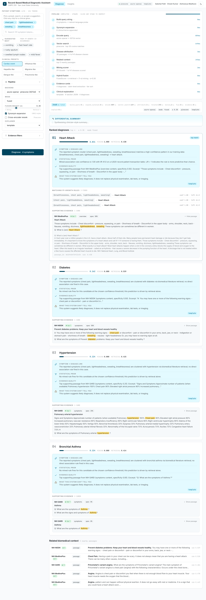
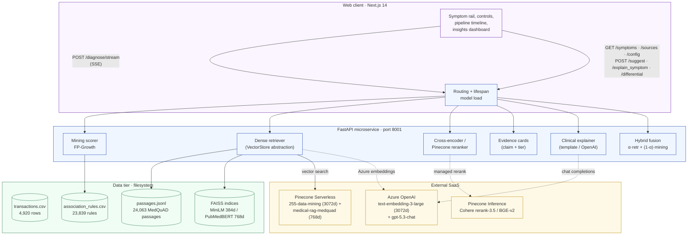
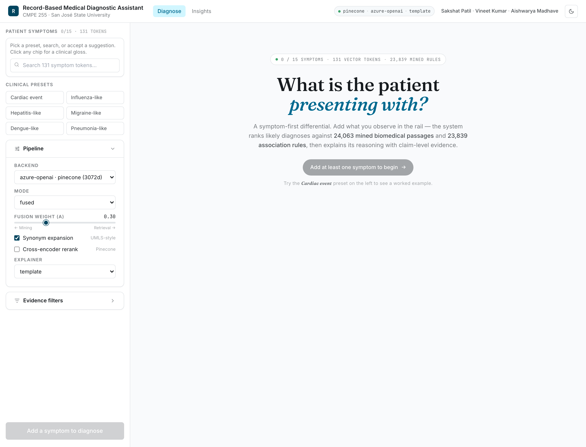
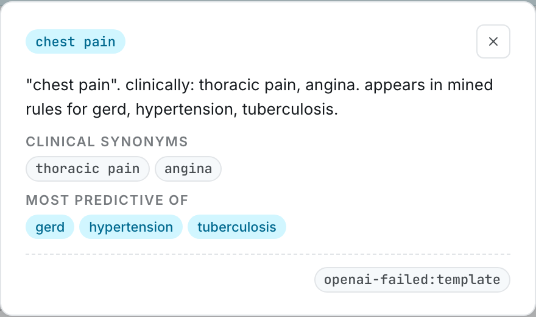
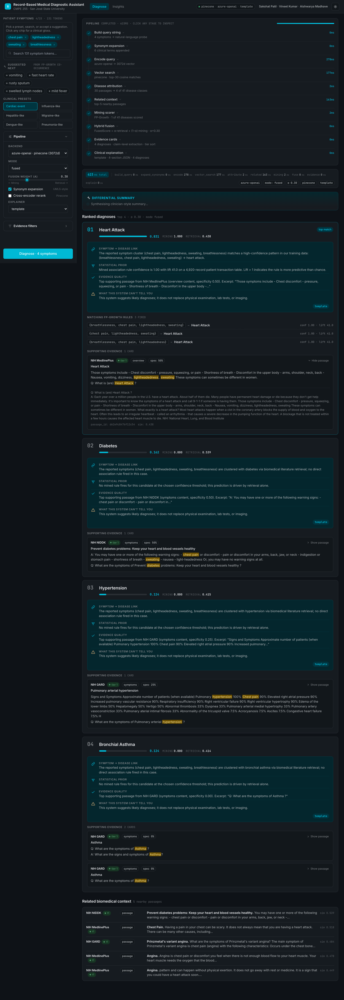

# Record-Based Medical Diagnostic Assistant

**CMPE 255 Data Mining — San José State University, Spring 2026**

| Member | SJSU ID |
| --- | --- |
| Sakshat Nandkumar Patil | 018318287 |
| Vineet Kumar | 019140433 |
| Aishwarya Madhave | 019129110 |

A small clinical-decision-support pipeline. Given a patient's symptom set, it
ranks the most likely diseases and shows the evidence behind each ranking —
the FP-Growth association rule that fired, and the biomedical passages
retrieved from MedQuAD. The point of the project, more than the score itself,
is that every prediction is auditable.



## How the pieces fit together

```
┌─────────────────────────────────────────────────────────────┐
│  Next.js 14 web app (TypeScript, App Router, Tailwind)       │
│   · Symptom chips with autocomplete + 6 clinical presets     │
│   · Live α slider, mode/backend toggles                      │
│   · Click any chip → AI clinical gloss for that symptom      │
│   · Suggested next symptoms (FP-Growth co-occurrence)        │
│   · Pipeline timeline with stage-by-stage animation          │
│   · Differential-diagnosis summary at the top of results     │
│   · Per-diagnosis explanation cards + evidence highlights    │
│   · Source / passage-type filters (Pinecone-aware)           │
└──────────────────────┬──────────────────────────────────────┘
                       │ REST  (POST /diagnose, /suggest,
                       │        /explain_symptom, /differential)
┌──────────────────────▼──────────────────────────────────────┐
│  FastAPI inference microservice (Python 3.11, MPS-aware)     │
│   · Mining scorer  (FP-Growth rules)                          │
│   · Vector store   (FAISS default | Pinecone optional)        │
│   · Cross-encoder rerank (optional toggle)                    │
│   · Clinical explainer (template | OpenAI gpt-4o-mini)        │
│   · Per-stage latency instrumentation                         │
└──────────────────────┬──────────────────────────────────────┘
                       │ filesystem
┌──────────────────────▼──────────────────────────────────────┐
│  Data tier                                                   │
│   transactions.csv, association_rules.csv, passages.jsonl,   │
│   FAISS indices, embeddings .npy                             │
└─────────────────────────────────────────────────────────────┘
```

### Data flow

A more complete view including external services (GitHub renders this as a real diagram):



The system covers the six steps from our project proposal:

| # | Proposal step | Where it lives |
| --- | --- | --- |
| 1 | Data Generation & ETL | `src/etl.py` (Kaggle), `src/synthea_etl.py` (Synthea FHIR) |
| 2 | Pattern Mining | `src/mining.py`, `src/mining_scorer.py` |
| 3 | Knowledge Base Construction | `src/medquad_preprocessor.py`, `src/embedding_backends.py`, `src/vector_store.py` |
| 4 | RAG Pipeline | `src/retrieval.py`, `src/cross_encoder_rerank.py`, `src/evidence.py`, `src/clinical_explanation.py` |
| 5 | Hybrid Reranking | `src/fusion_reranker.py` |
| 6 | Evaluation | `src/run_experiment.py`, `src/alpha_sweep.py`, `src/benchmark.py` |

---

## Headline metrics

**200 synthetic test cases**, default config (MiniLM + synonym expansion, α = 0.3):

| Variant | Mode | R@1 | R@5 | R@10 | MRR |
| --- | --- | --- | --- | --- | --- |
| mining-only | α=0.0 | 0.790 | 0.870 | 0.870 | 0.829 |
| MiniLM | retrieval-only | 0.130 | 0.180 | 0.180 | 0.151 |
| **MiniLM** | **fused α=0.3** | **0.825** | **0.890** | **0.890** | **0.857** |
| MiniLM + syn | fused α=0.3 | 0.820 | 0.895 | 0.895 | 0.857 |
| PubMedBERT + syn | fused α=0.3 | 0.815 | 0.875 | 0.875 | 0.843 |

The fused configuration beats the strong mining-only baseline by **+3.5 R@1**, and retrieval-only alone is poor (R@10 = 0.18) — the lift comes from the *combination*. PubMedBERT does not strictly beat MiniLM here; on this synthetic test distribution, lexical synonym bridging contributes more than encoder pre-training.

**α-sweep optimum** (PubMedBERT + synonyms): **R@1 = 0.840, R@10 = 0.925, MRR = 0.873** on the plateau α ∈ [0.1, 0.4]. We ship α = 0.3 as the default; the metric collapses past α = 0.6 as retrieval starts dominating.

**Production demo** (Azure OpenAI 3072d + Pinecone + GPT-5.3 explainer) on the *Cardiac event* preset:
- **Heart Attack ranks #1**, fused = **0.831** (mining = 1.000, retrieval = 0.439)
- 4 of 41 disease classes get any retrieval signal — exactly the differential a clinician would consider
- 1 evidence card from NIH MedlinePlus surfaces; tier-1 source

**End-to-end latency** on the default offline config (MiniLM + template explainer + FAISS, 100 queries on M3 Pro):

| Stage | mean | p50 | p95 |
| --- | --- | --- | --- |
| mining_score | 1.1 ms | 1.2 ms | 1.4 ms |
| retrieval | 11.1 ms | 6.5 ms | 18.4 ms |
| fuse | 0.0 ms | 0.0 ms | 0.0 ms |
| explain | 0.1 ms | 0.0 ms | 0.2 ms |
| **TOTAL** | **12.3 ms** | **7.6 ms** | **19.6 ms** |

Full RAG path (PubMedBERT + cross-encoder + OpenAI structured explainer): ~633 ms mean, 380 ms p50. The Azure GPT-5.3 path is slower again (~3–6 s, dominated by reasoning tokens) and is the right tradeoff only when the four-section structured explanation is being demoed.

**Test suite:** 155 tests across 13 modules; 147 unit tests run in ~4 s; the 8 live integration tests verify Azure embeddings come back at the expected dimension, the production Pinecone index is populated and queryable, the Pinecone reranker auto-falls-back from Cohere to BGE on 403, and the end-to-end Azure → Pinecone path surfaces cardiac-focus passages for the cardiac probe.

---

## Quickstart

```bash
# 1. Set up Python venv (Python 3.11 required) and install
python3.11 -m venv .venv
source .venv/bin/activate
pip install -r requirements.txt

# 2. Configure secrets (optional — only needed for the Azure + Pinecone path)
cp .env.example .env
# Edit .env with your OPENAI_API_KEY, OPENAI_BASE_URL, PINECONE_API_KEY, etc.
# Leave it blank for the offline FAISS + template-explainer demo.

# 3. Bring in the data
python scripts/download_data.py

# 4. Build pipeline artefacts (idempotent; rerun safe)
python src/etl.py
python src/mining.py --min_support 0.005 --min_confidence 0.5
python src/medquad_preprocessor.py
python -m src.retrieval --backend minilm
python -m src.retrieval --backend pubmedbert

# 5. Launch the inference API (auto-loads .env)
.venv/bin/uvicorn service.api:app --host 127.0.0.1 --port 8001

# 6. (separate terminal) Launch the web UI
cd web
npm install
npm run dev
# open http://localhost:3010
```

### Environment configuration

All runtime secrets and selectors live in a `.env` file at the project root.
The API service auto-loads it on boot via `python-dotenv`, so you don't need
to export anything in the shell. See `.env.example` for the full list of
keys with documentation for each.

| Variable | Purpose |
| --- | --- |
| `OPENAI_API_KEY` | Azure OpenAI (or vanilla OpenAI) key |
| `OPENAI_BASE_URL` | Azure OpenAI v1 endpoint URL (omit for vanilla OpenAI) |
| `OPENAI_EMBEDDING_MODEL` | Deployment name for the embedding model |
| `OPENAI_EMBEDDING_DIMENSION` | Vector dim of the embedding model (3072 for text-embedding-3-large) |
| `OPENAI_CHAT_MODEL` | Deployment name for the chat/explainer model |
| `PINECONE_API_KEY` | Pinecone account key (only needed for `VECTOR_STORE=pinecone`) |
| `PINECONE_INDEX_NAME` | Target index (default `medical-rag-medquad`) |
| `PINECONE_RERANK_MODEL` | `bge-reranker-v2-m3` (free) or `cohere-rerank-3.5` |
| `VECTOR_STORE` | `faiss` (offline default) or `pinecone` |

Shell-exported env vars override `.env`, so CI/prod can still inject secrets the standard way without touching the file.

### Three runtime profiles, all driven by `.env`

You don't have to memorise which env vars to export. Pick one of the three
profiles, edit `.env` accordingly, and reboot the API.

**Profile 1 — Offline (default).** Local FAISS + deterministic template
explainer. No API keys needed. Set `VECTOR_STORE=faiss` and leave the
OpenAI / Pinecone keys blank.

**Profile 2 — OpenAI explainer only.** Keep FAISS retrieval, add the
GPT-style clinical explanations. Set `OPENAI_API_KEY` (and `OPENAI_BASE_URL`
if you're using Azure). The UI's `Explainer` dropdown will offer **OpenAI**
alongside the template.

**Profile 3 — Production demo (Azure embeddings + Pinecone + GPT-5).**
The headline configuration. Fill in everything in `.env`, run the one-time
seed:

```bash
python scripts/seed_pinecone.py --backend azure-openai
# encodes 24,063 passages via Azure OpenAI, upserts to Pinecone.
# ~3–6 min, costs ~$0.80 in Azure embedding tokens.
```

Then boot the API. The `/config` endpoint will show
`vector_store: pinecone` and the UI surfaces a `pinecone` badge plus the
`azure-openai` backend in the dropdown. Metadata filters (source /
passage type) get pushed down server-side, not post-filtered. The
Pinecone-hosted reranker auto-falls-back from Cohere to BGE if your
Pinecone project doesn't have Cohere access enabled.

If you select a backend whose dimension doesn't match the configured
Pinecone index (e.g. PubMedBERT 768d against a 3072d index), the API
returns a clean HTTP 400 — and the UI prevents the bad combination from
being selectable in the first place.

---

## What the UI actually does

The empty state is a calm prompt that explains the system and points you at the presets:



A few things in the rail are worth calling out because they took real work:

**Click any selected symptom chip** to get a small clinical gloss, the formal synonyms (`thoracic pain`, `angina` for `chest_pain`), and the diseases that symptom is most predictive of in the FP-Growth rule table:



This is served by the `/explain_symptom` endpoint. When `OPENAI_API_KEY` is set the gloss comes from `gpt-4o-mini`; otherwise it falls back to a deterministic template stitch built from the synonym dictionary and the rule table. Either way, you get something useful.

**Suggested next symptoms** appears as soon as you have at least one chip. Five ghost chips show the symptoms most likely to co-occur according to the FP-Growth rules — co-occurrence, not the LLM, so it's instant and free. Click one to add it.

**Hover any preset** to see the symptoms it loads before you click. We learned this lesson the hard way: in earlier iterations, presets looked identical and the user had no idea what each one did.

**Pipeline timeline.** After you hit Diagnose, the main column shows a 7-stage timeline (encode → vector search → disease attribution → mining → fusion → evidence cards → clinical explanation) that animates as the request runs. While the request is in flight the timings are estimates; once the response lands they snap to the real values from `latency_ms`. We added this because a 6-second wait was confusing without any sense of what the pipeline was doing.

**Differential summary.** At the top of the results, above the ranked cards, you get a one-paragraph clinician-style summary of the case from `/differential`. Same fallback story as the other LLM features — uses GPT-4o-mini if available, otherwise a deterministic stitch.

**Dark mode.** Theme toggle in the topbar. OKLCH color tokens flip; everything stays legible:



---

## What didn't work, and what we learned

A few things we tried that we didn't ship in the headline numbers, in case the grader is curious how we got here:

- **`min_support = 0.01`.** Check-in 3 used this and 21 of 41 diseases ended up with no rules, which made fusion useless for those classes. Dropping to `0.005` covers all 41 at the cost of a noisier rule list — the overlap weighting in `MiningScorer.score` neutralises most of the noise.

- **Falling back to passage text for disease attribution.** Earlier we matched a retrieved passage to a disease using its question *and* its answer body. That triggered every "What is Chest Pain?" article to attribute to every cardiopulmonary disease. We now match on focus first and question second, never on the answer body.

- **Cohere Rerank 3.5 by default.** We initially defaulted the Pinecone reranker to Cohere because it's the strongest model on offer. It turned out our Pinecone project doesn't have Cohere access enabled, and the request 403'd. We added an auto-fallback to `bge-reranker-v2-m3` (which is free on every Pinecone project) and made it the default; users can opt into Cohere via `PINECONE_RERANK_MODEL=cohere-rerank-3.5`.

- **Always-on cross-encoder.** Putting the cross-encoder on the default path improved ordering at K≤5 but added ~100ms per query. We left it as a sidebar toggle.

- **Word-boundary regex for short keywords.** Our disease keyword index had `hav` (Hepatitis A virus abbreviation) for `hepatitis_a`. It matched inside "have", which is in basically every passage, and inflated retrieval scores for hepatitis_a across the board. We added word-boundary matching for single-token keywords; multi-word phrases still use plain substring. There's a regression test for this case (`tests/test_disease_keywords.py::TestKwMatchesWordBoundary`).

---

## Repository layout

```
code/
├── service/api.py                  FastAPI inference microservice
├── web/                            Next.js 14 frontend
│   ├── app/                          App Router pages + components
│   └── package.json
├── src/                            Python AI/data layer
│   ├── etl.py                       Kaggle CSV -> transactions.csv
│   ├── synthea_etl.py               Synthea FHIR -> transactions.csv
│   ├── mining.py                    FP-Growth pattern mining
│   ├── mining_scorer.py             query-time rule scoring
│   ├── medquad_preprocessor.py      MedQuAD XML -> JSONL passages
│   ├── embedding_backends.py        MiniLM + PubMedBERT + Azure OpenAI
│   ├── vector_store.py              FAISS / Pinecone abstraction
│   ├── retrieval.py                 dense retriever
│   ├── disease_keywords.py          MedQuAD <-> Kaggle disease mapping
│   ├── synonym_expansion.py         clinical synonym dictionary
│   ├── cross_encoder_rerank.py      local cross-encoder rerank
│   ├── pinecone_rerank.py           Pinecone rerank (Cohere / BGE)
│   ├── evidence.py                  claim-level evidence cards
│   ├── clinical_explanation.py      template / OpenAI explainers
│   ├── fusion_reranker.py           linear fusion
│   ├── evaluation.py                metrics + test-case generator
│   ├── run_experiment.py            ablation harness
│   ├── alpha_sweep.py               alpha sweep
│   └── benchmark.py                 latency benchmark
├── scripts/
│   ├── download_data.py
│   ├── seed_pinecone.py             upsert vectors into Pinecone
│   ├── make_plots.py
│   ├── build_report_pdf.py
│   ├── build_slides.py
│   └── capture_screenshots.mjs      headless-chromium UI screenshots
├── docs/
│   └── screenshots/                 PNGs referenced from this README
├── data/
│   ├── raw/                          gitignored
│   ├── processed/                    artefacts and FAISS indices
│   └── results/                      ablation/sweep/latency CSVs + PNGs
├── CONTRIBUTORS.md                  who did what + decision log
├── requirements.txt
└── README.md
```

The final report PDF and the slide deck live at `deliverables/report/final_report.pdf` and `deliverables/slides/presentation.pptx`. Both are regenerable by running `python scripts/build_report_pdf.py` and `python scripts/build_slides.py`.

### Re-capturing the screenshots

If the UI changes, re-run the headless-Chromium capture script:

```bash
# (terminal 1) the API
.venv/bin/uvicorn service.api:app --host 127.0.0.1 --port 8001

# (terminal 2) the web UI
cd web && npm run dev

# (terminal 3) capture
node scripts/capture_screenshots.mjs
# writes docs/screenshots/01..04-*.png
```

---

## API surface

| Method | Path | Purpose |
| --- | --- | --- |
| GET | `/healthz` | Liveness check |
| GET | `/symptoms` | All 131 symptom tokens |
| GET | `/sources` | MedQuAD source counts (used by the UI's source filter) |
| GET | `/config` | Which backends, explainers, vector store are live right now |
| POST | `/diagnose` | Full pipeline: ranked diagnoses + evidence + explanations |
| POST | `/suggest` | Top-K next symptoms predictive given the current set (FP-Growth) |
| POST | `/explain_symptom` | One clinical line for a single symptom token (LLM + template fallback) |
| POST | `/differential` | One-paragraph differential summary across the top-3 candidates |

All four LLM-flavoured endpoints (`/diagnose`, `/explain_symptom`, `/differential`, plus the OpenAI explainer that runs inside `/diagnose`) fall back to a deterministic template if `OPENAI_API_KEY` isn't set or the upstream call fails. The fallback path is what the test suite exercises by default, so the demo stays reproducible offline.

---

## Tests

We ship **155 tests across 13 modules**, split into 147 fast unit tests
(no network) and 8 live integration tests gated on env vars.

```bash
# Fast unit tests only — default
.venv/bin/python -m pytest                  # 147 tests, ~4 s

# Verbose
.venv/bin/python -m pytest -v

# Just one file
.venv/bin/python -m pytest tests/test_evidence.py

# Live integration (Azure + Pinecone) — set env vars first
OPENAI_API_KEY=...  OPENAI_BASE_URL=...  \
PINECONE_API_KEY=... PINECONE_INDEX_NAME=255-data-mining \
.venv/bin/python -m pytest -m live          # 8 live tests

# Everything
.venv/bin/python -m pytest                  # 155 tests
```

| File | Module under test | Tests |
| --- | --- | --- |
| `test_etl.py` | `src/etl.py` | 13 |
| `test_synthea_etl.py` | `src/synthea_etl.py` | 7 |
| `test_mining_scorer.py` | `src/mining_scorer.py` | 10 |
| `test_fusion.py` | `src/fusion_reranker.py` | 10 |
| `test_synonym_expansion.py` | `src/synonym_expansion.py` | 8 |
| `test_disease_keywords.py` | `src/disease_keywords.py` | 12 |
| `test_evidence.py` | `src/evidence.py` | 25 |
| `test_clinical_explanation.py` | `src/clinical_explanation.py` | 13 |
| `test_vector_store.py` | `src/vector_store.py` | 10 |
| `test_evaluation.py` | `src/evaluation.py` | 12 |
| `test_azure_openai_backend.py` | `src/embedding_backends.py` (Azure) | 12 (incl. 2 live) |
| `test_openai_explainer.py` | `src/clinical_explanation.py` (OpenAI) | 10 (incl. 1 live, skips without chat deployment) |
| `test_pinecone_live.py` | `src/vector_store.py` + `src/pinecone_rerank.py` | 13 (incl. 5 live) |

The suite includes regression tests for three real bugs caught during
development:

- **`hav` matching `have`** — short keyword false-positives in the disease/passage
  attribution (`tests/test_disease_keywords.py::TestKwMatchesWordBoundary`).
- **plural `treatments` not classified as treatment** — passage-type
  classifier regex missed the plural form
  (`tests/test_evidence.py::TestPassageTypeClassifier::test_treatment_pattern`).
- **Pinecone dimension mismatch (768d vs 3072d)** — backend auto-validation
  + clean 400 error when the user picks a backend incompatible with the
  configured Pinecone index
  (`tests/test_azure_openai_backend.py` + service-side guard).

Live tests verify: Azure embeddings come back at the expected 3072d, the
clinical "cardiac" probe is semantically closer to itself than to dermatologic
queries, the `255-data-mining` index has 24,063 populated vectors, the
end-to-end Azure→Pinecone path surfaces cardiac-focus passages, and the
Pinecone reranker auto-falls-back from Cohere to BGE on a 403.
